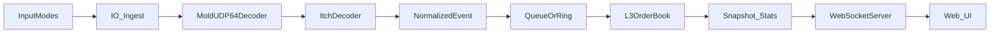

# Architecture (skeleton)

This document describes the intended dataflow. Most modules are currently TODO.

## Pipeline

## Input modes

- pcap_replay: libpcap reads packets -> extract UDP payload -> MoldUDP64 decode
- itch_binfile_replay: read length-prefixed ITCH messages -> feed ITCH decoder (or wrap as pseudo Mold)
- udp_live: UDP socket receives MoldUDP64 datagrams
- sim_udp: synthetic generator creates ITCH messages -> wraps in MoldUDP64 -> sends over UDP

## Core invariants

- L3 book maintains per order state (not aggregated only)
- Per price FIFO is preserved
- Level totals must equal sum(order qty) in that level
- No negative quantities

## Backpressure / bounded memory

- Decode -> Book boundary uses a bounded queue (mutex or ring)
- UI bus is bounded
- Frontend tape buffer is bounded
